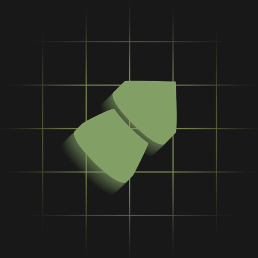
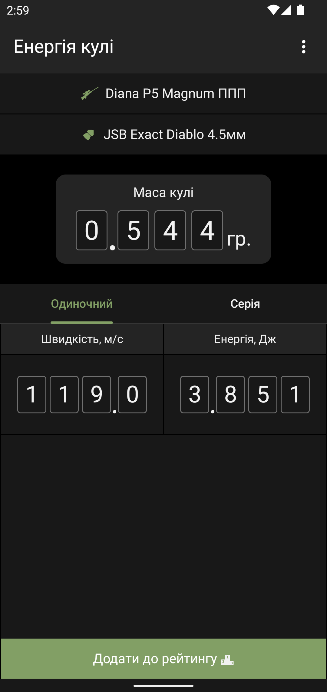
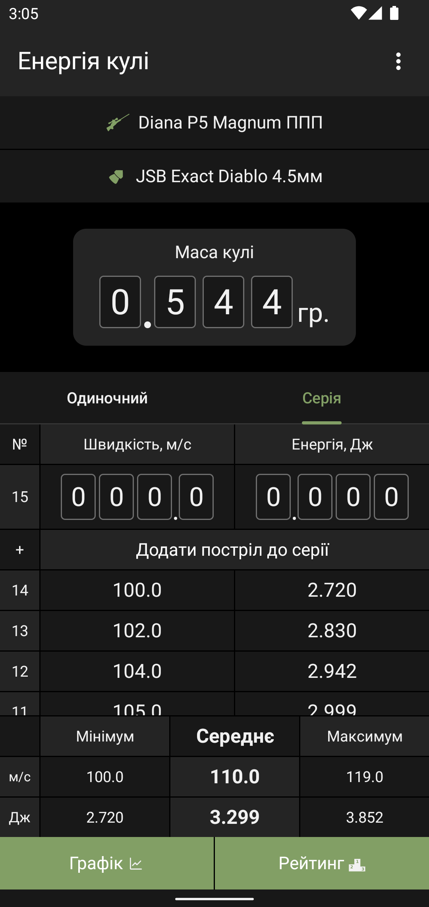
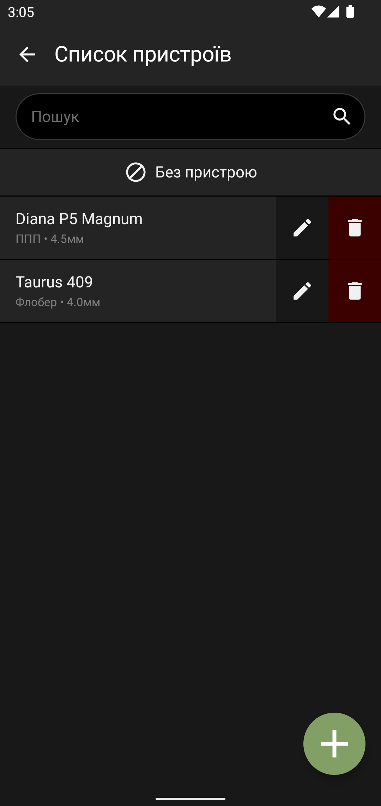
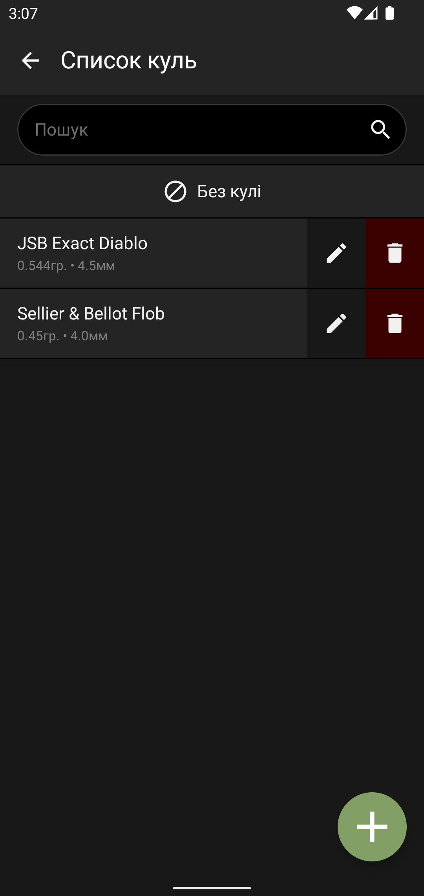
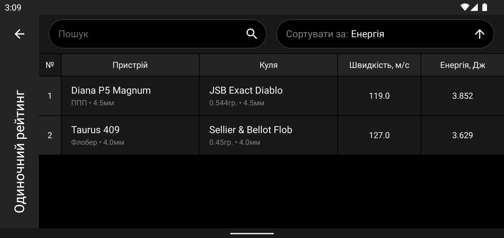
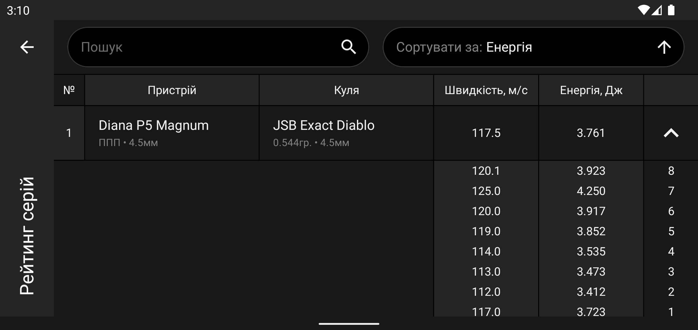
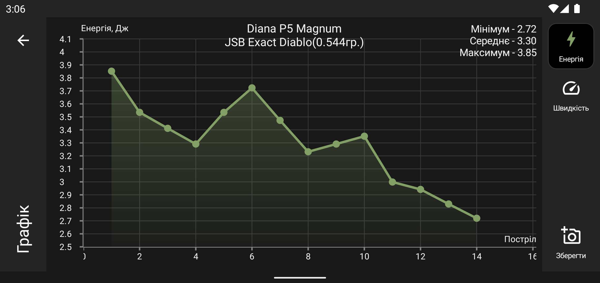
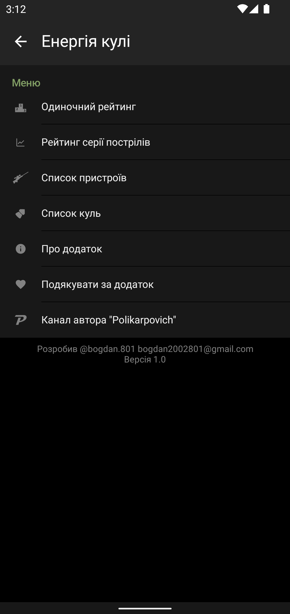

# BulletPower
Simple app to measure the energy of bullets fired from pneumatic weapons

## Features
- Measuring single shot energy of a bullet
- Measuring the energy of multiple shots in a series 
- Saving and comparing the performance of different devices and bullets in the rating
- Building and exporting the graph of the shot series performance

## Overview
### Single shot screen

### Multiple shot screen

### Device/Bullet selector screen
   

### Single/Multiple shot rating screen

### Graph screen

### Menu screen

## Technologies used to make an app
- [Kotlin](https://kotlinlang.org/)
- MVVM Architecture pattern
- [Room](https://developer.android.com/training/data-storage/room) local database
- [Dagger-hilt](https://dagger.dev/hilt/) for dependency injection
- [Jetpack Compose](https://developer.android.com/jetpack/compose) for the UI
- [Compose Navigation](https://developer.android.com/jetpack/compose/navigation)
- [Accompanist libraries](https://google.github.io/accompanist/) for UI components that are not yet available in the default Jetpack Compose collection
